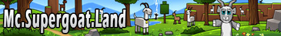

# **Super GoatLand**

Super GoatLand is a small community of adults, ran by adults, and for adults. We no longer allow those under 18 to join,
as our focus is to continue building an adult community. One of the struggles we experience as adults is meeting new
people and making friends, and that is what we aim to overcome by providing an adult-friendly community, where folks can
join, meet new people, socialize, have fun, and be able to call this place a home.

Minecraft is our main community game; however, we do play other games together as a community. In the past, we have
played Among Us, Risk of Rain 2, Valheim, and 7 Days to Die (Vanilla & Modded).

For Minecraft, here are a few things we do differently:

1. We will not purge player creations after a period of time - your creations will exist for as long as the world
   exists. For world resets (which will happen for 1.18), we will find ways to bring that old world back (either as a
   dimension after time or a download). Please note: we may need to clean up creations that have a negative impact on
   the server.
2. We host both a survival server and a creative server.
3. Any plugins added to Survival are focused on providing a Vanilla+ experience in a balanced way--such as player head
   trades, a few new items, custom events, custom portals, additional recipes, etc.

For 1.17, we will be continuing the existing world; however, we will be purging a lot of inactive chunks across all maps
and will be moving the spawning point to be primarily within 1.17 chunks only. Both spawns will be connected via
portals, so you’ll have easy access to both the old and new spawn. New players will be able to experience 1.17 content
from the very beginning.

We host a fair share of community events, based on community interest, such as build contents, races, PvP events,
treasure hunts, and so much more.

Feel free to check out our bluemap, https://map.supergoat.land.

To join, we ask that you fill out the application below on our Discord (https://discord.gg/supergoatland). Tell us about
yourself and why you think you’ll be a good fit. Applications can take up to 24 hours to process, so please be patient.

1. Your age.
2. Your in-game name (IGN).
3. What are you looking for in a Minecraft server?
4. Tell us a bit about yourself.
5. Why do you think you’ll be a good fit?
6. Where did you hear about us?
